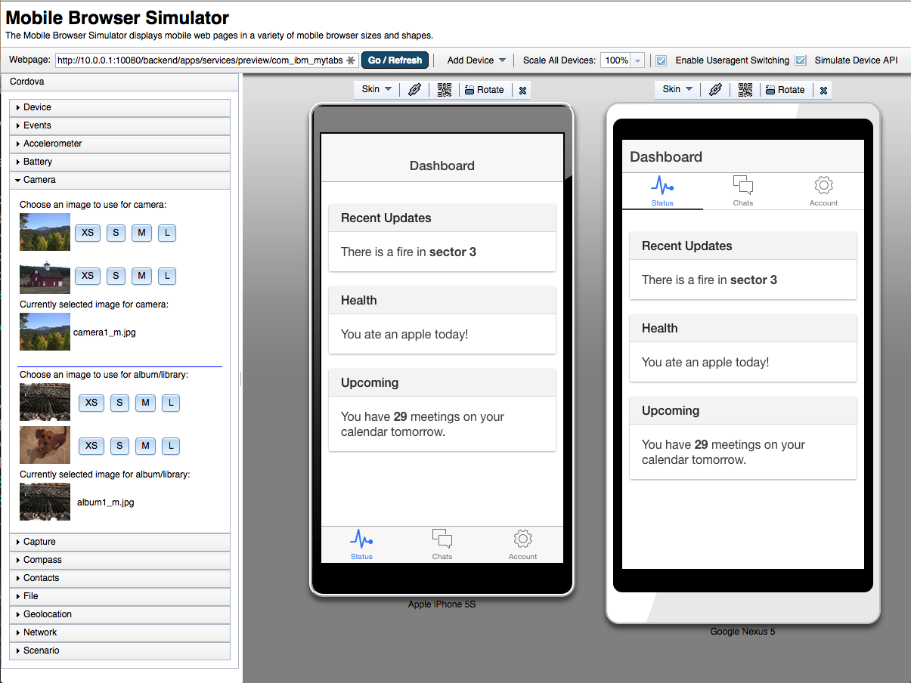

##Ionic templates for MobileFirst Platform Foundation (MFP)

### Install

- Download the Ionic templates for MFP

```javascript
$ git clone https://github.com/csantanapr/mfp-ionic-templates.git
````
- Download and Install the [MobileFirst Platform Foundation (MFP) CLI](https://developer.ibm.com/mobilefirstplatform/install/#clui) 7.1 (August 2015)

### How to use

- Create a Cordova App using one of the templates (blank, tabs, sidemenu) and run npm install
- MFP cordova create can take more arguments, must specify at least one platform ios or android (mfp help cordova create for more info)

```javascript
$ mfp cordova create myapp -p ios,android -t mfp-ionic-templates/blank
$ cd myapp
$ npm install
````

or in one single command (Linux, Mac)

```javascript
$ APP=myapp; mfp cordova create ${APP} -p ios,android -t mfp-ionic-templates/blank && cd ${APP} && npm install
````

### How to use the MFP CLI

- Use mfp cli to add additional platforms and plugins

```javascript
$ mfp cordova platform add 
$ mfp cordova platform add android
$ mfp cordova plugin add 
$ mfp cordova plugin add cordova-plugin-mfp-jsonstore
$ mfp cordova plugin add cordova-plugin-mfp-push

````

- Use mfp cli to emulate and run

```javascript
$ mfp cordova emulate
$ mfp cordova emulate -p ios
$ mfp cordova run
$ mfp cordova run -p android

````

- Use ionic cli for other cordova actions

```javascript
$ ionic prepare
$ ionic build
```

- To Preview using MobileFirst Browser Simulator you need a local development Server with a backend

```javascript
$ cd ../
$ mfp create backend
$ cd backend
$ mfp start
$ cd ../myapp/
$ mfp cordova preview
```

- Push the app to a remote server like the one in Bluemix Containers (Docker)

```javascript
$ mfp server add
$ mfp push <servername>
$ mfp console <servername>
```

### Demo


### License
Apache 2.0
